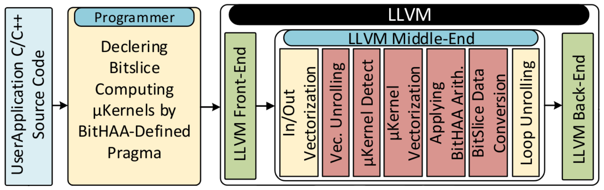

# BitHAA Front-End Sub-system

This repository contains a version of BitHAA's front-end section. Here, we will instruct the readers on how to convert their normal calculations into BitSliced ones. **Note that** this is not the final version of our Front-End, but the difference is negligible. Instructions on installation, building, and running this module are given.

This image was shown in the article in order to further demonstrate the Front-End's workflow:



## Prerequisites

You only need to clone the `LLVM` project:
```bash
$ git clone https://github.com/llvm/llvm-project.git
```

## Building `LLVM`

Here you need to create the `LLVM`'s `.build` folder:

```bash
$ mkdir .build
$ cd .build
$ cmake -G "Ninja" -DCMAKE_BUILD_TYPE=RelWithDebInfo -DLLVM_ENABLE_PROJECTS="clang" -DLLVM_TARGETS_TO_BUILD="X86" -DLLVM_USE_LINKER=gold -DLLVM_PARALLEL_LINK_JOBS=2 ../llvm-project/llvm
$ ninja -j8 all
```

**(Optional)** You can set environment variables in order to make the next steps. Something like this could be done:
```bash
$ export LLVM_PATH=<Path to llvm-project folder>
$ export PROJECT_PATH=<Path to our code>
```

## Usage

compiling

Start writing your libraries in the `lib` folder. Two sample libraries are shown in the `lib` folder of this repo.

```bash
$ export LLVM_DIR=/${BUILD_PATH}/lib/cmake/llvm/
$ cd ${PROJECT_PATH}
$ mkdir .build
$ cd .build
$ cmake -G "Ninja" ../
$ ninja
```

After this, the plugins are ready to be used in the `.build/lib/` folder as `*.so` files.

NAMEFILE

Create your input files in the `inputs` folder. Then, follow these commands to produce your object files. Note that our you need to replace some names in the following code.

```bash
$ cd ${PROJECT_PATH}/inputs
$ /${LLVM_PATH}/.build/bin/clang -emit-llvm -S -O1 <INPUT_FILENAME.c>
$ /${LLVM_PATH}/.build/bin/opt -load-pass-plugin <../.build/lib/DESIRED_LIB.so> -passes=<Pass Name> <INPUT_FILENAME.ll> -S -o <OUTPUT_FILENAME.ll>
```

Now, your object files are ready to use in the `inputs` folder.


In this repository, we have provided an example of vectorized add/sub to help readers understand the procedure by running the code. Note that these two operations are for demonstration purposes, and we will provide our complete and final Front-End in our open-source tool.
